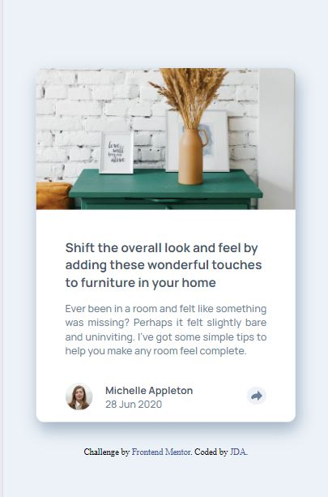
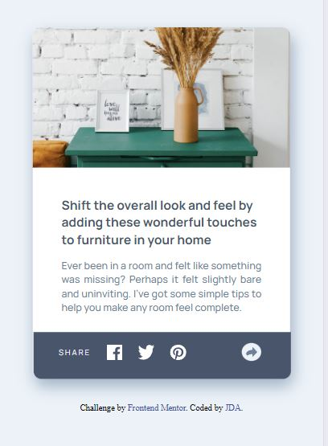

# Frontend Mentor - Article preview component solution

This is a solution to the [Article preview component challenge on Frontend Mentor](https://www.frontendmentor.io/challenges/article-preview-component-dYBN_pYFT). Frontend Mentor challenges help you improve your coding skills by building realistic projects. 

## Table of contents

- [Overview](#overview)
  - [The challenge](#the-challenge)
  - [Screenshot](#screenshot)
  - [Links](#links)
  - [Useful resources](#useful-resources)

## Overview

### The challenge

Users should be able to:

- View the optimal layout for the component depending on their device's screen size
- See the social media share links when they click the share icon

### Screenshot

### Links

- Live Site URL: [here](https://65df430740f26c16eda20ed1--leafy-chebakia-9118ed.netlify.app/)

### Useful resources

- [How to create tooltip](https://www.w3schools.com/howto/howto_css_tooltip.asp) - This helped me for create an arrow down for balloon popup
