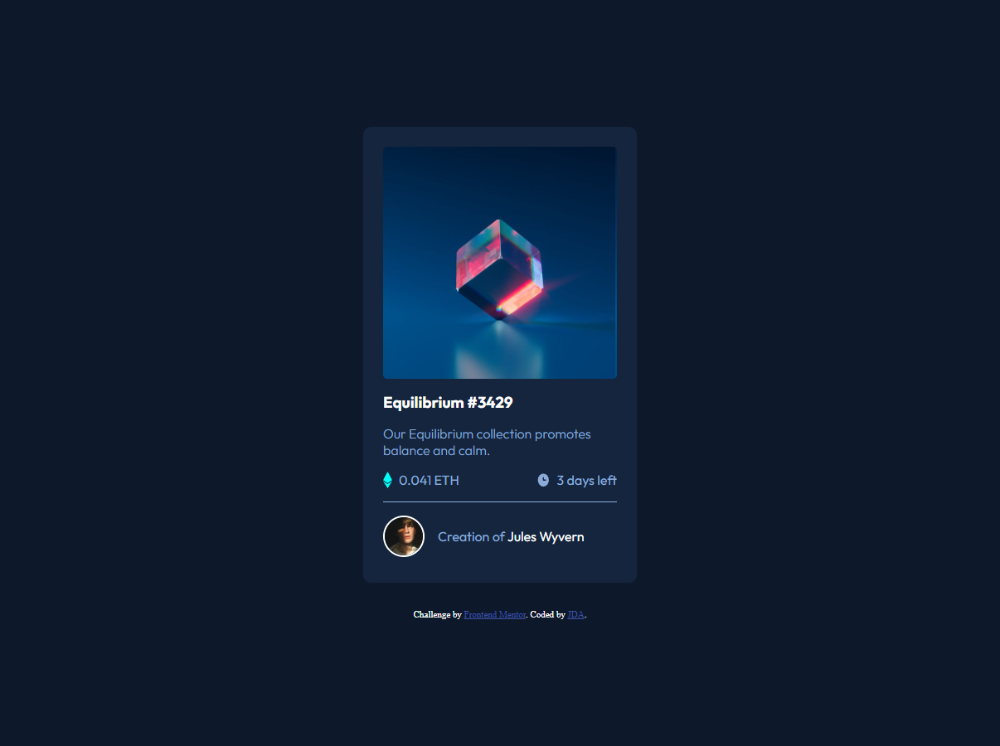

# Frontend Mentor - NFT preview card component solution

This is a solution to the [NFT preview card component challenge on Frontend Mentor](https://www.frontendmentor.io/challenges/nft-preview-card-component-SbdUL_w0U). Frontend Mentor challenges help you improve your coding skills by building realistic projects. 

## Table of contents

- [Overview](#overview)
  - [The challenge](#the-challenge)
  - [Screenshot](#screenshot)
  - [Links](#links)
  - [Useful resources](#useful-resources)

## Overview

### The challenge

Users should be able to:

- View the optimal layout depending on their device's screen size
- See hover states for interactive elements

### Screenshot

### Links

- Live Site URL: [here](https://65db5b0caeab2ee8ea0843ba--leafy-chebakia-9118ed.netlify.app/)

### Useful resources

- [Adding overlay over background image](https://stackoverflow.com/questions/9182978/semi-transparent-color-layer-over-background-image) 
- [Display an element on hover](https://www.w3schools.com/howto/howto_css_display_element_hover.asp)
