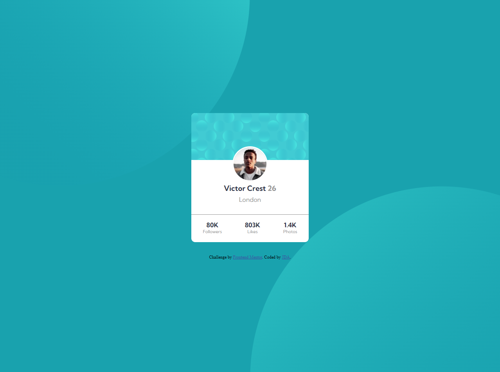

# Frontend Mentor - Profile card component solution

This is a solution to the [Profile card component challenge on Frontend Mentor](https://www.frontendmentor.io/challenges/profile-card-component-cfArpWshJ). Frontend Mentor challenges help you improve your coding skills by building realistic projects. 

## Table of contents

- [Overview](#overview)
  - [The challenge](#the-challenge)
  - [Screenshot](#screenshot)
  - [Links](#links)
  - [Useful resources](#useful-resources)

## Overview

### The challenge

- Build out the project to the designs provided

### Screenshot

### Links

- Live Site URL: [here](https://65ddc67316593400a639945c--leafy-chebakia-9118ed.netlify.app/)
