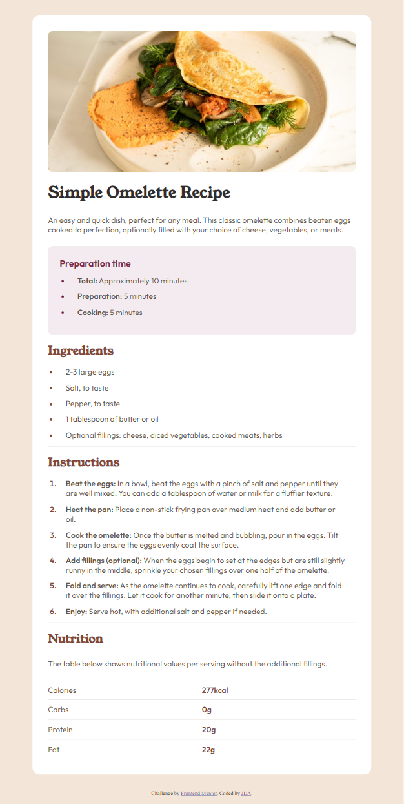
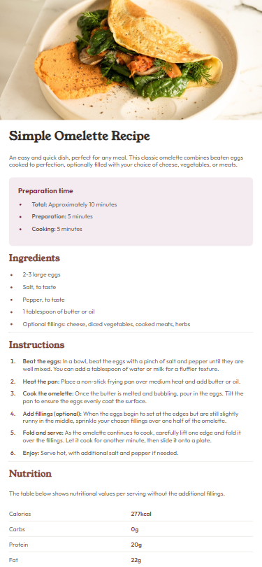

# Frontend Mentor - Recipe page solution

This is a solution to the [Recipe page challenge on Frontend Mentor](https://www.frontendmentor.io/challenges/recipe-page-KiTsR8QQKm). Frontend Mentor challenges help you improve your coding skills by building realistic projects. 

## Table of contents

- [Overview](#overview)
  - [The challenge](#the-challenge)
  - [Screenshot](#screenshot)
  - [Link](#links)
  - [Useful resources](#useful-resources)
- [Author](#author)

## Overview

### Screenshot

### Link

- Live Site URL: [here](https://65d779a2568a590cd1fcb41b--leafy-chebakia-9118ed.netlify.app/)

### Useful resources

- [Remove column dividers in a html table](https://stackoverflow.com/questions/3331111/remove-column-dividers-in-a-html-table) - This is a helpful article that helped me style the table

## Author

- Frontend Mentor - [@ClairJDA](https://www.frontendmentor.io/profile/ClairJDA)