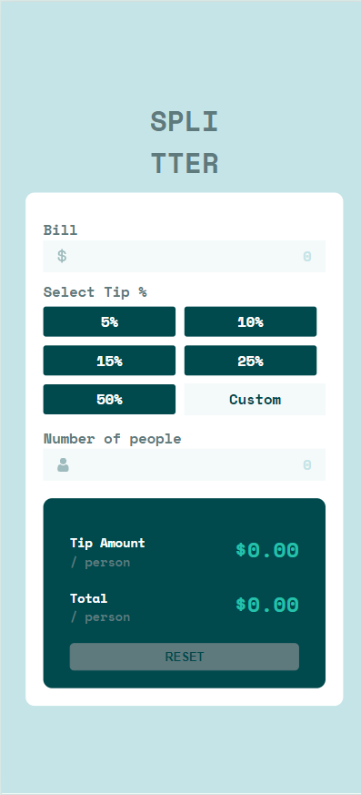
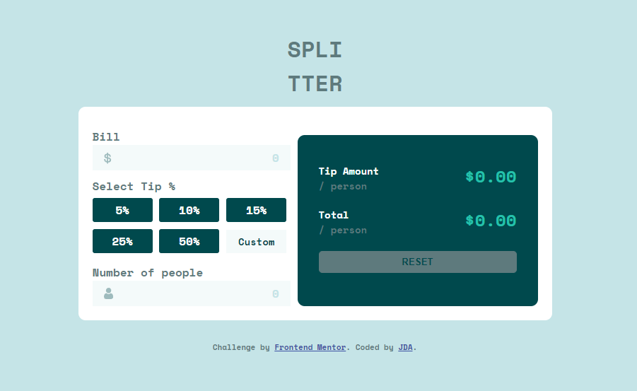

# Frontend Mentor - Tip calculator app solution

This is a solution to the [Tip calculator app challenge on Frontend Mentor](https://www.frontendmentor.io/challenges/tip-calculator-app-ugJNGbJUX). Frontend Mentor challenges help you improve your coding skills by building realistic projects.

## Table of contents

- [Overview](#overview)
  - [The challenge](#the-challenge)
  - [Screenshot](#screenshot)
  - [Links](#links)
  - [Useful resources](#useful-resources)

## Overview

### The challenge

Users should be able to:

- View the optimal layout for the app depending on their device's screen size
- See hover states for all interactive elements on the page
- Calculate the correct tip and total cost of the bill per person

### Screenshot

### Links

- Live Site URL: [here](https://666fe635cdc66011bb045ce0--earnest-taffy-1191f7.netlify.app/)

### Useful resources

- [Attach event listener through radio button](https://stackoverflow.com/questions/8922002/attach-event-listener-through-javascript-to-radio-button) - This helped me add the event listener through the radio button and an identification index was selected.